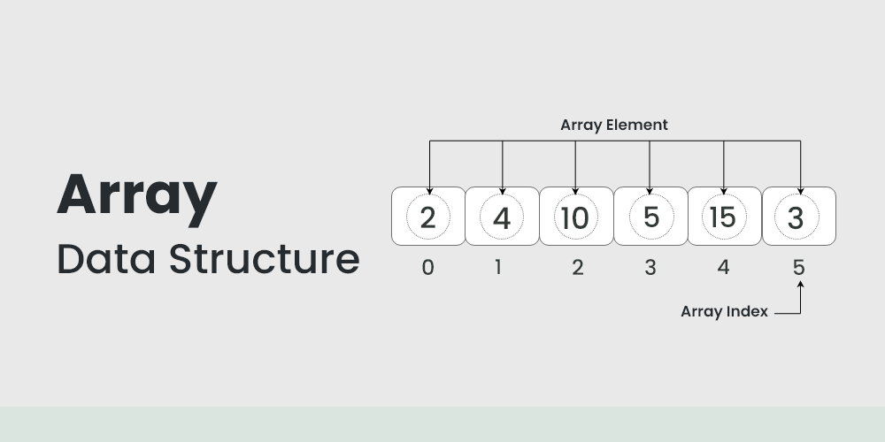

# Recursion and its Applications
  
This branch holds the various basics and applications that expolres the domain of Arrays to be solved.  

  

__See me on LinkedIn :__ [Link to my LinkedIn ID](https://www.linkedin.com/in/khajanbhatt/)
    
## Topics Covered
  - Single Dimension Array
  - Multi Dimension Array
  - Declarations and Initializations
  - Dynamic Arrays and Resizing
  - Array Abstract Data Type
  
## Array Abstract Data Type
  - Data Members:
     - Array Memory : Total space occupied by array
     - Array Size : Total array size including uninitialized indices
     - Array Length : No. of elements in array

  - Method Functions :

     - __Display (array arr)__ -> Return void :
         - Shows all elements in the array.
     - __Insert	(array *arr, int index, int value)__ -> Return void :
         - Inserts a value at a specified index.
     - __Delete	(array *arr, int index)__ -> Return int :
         - Deletes an element at a given index.
     - __Search	(array arr, int value)__ -> Return int :
         - Finds the index of a specified value.
     - __Get (array arr, int index)__ -> Return int :
         - Retrieves the element at a given index.
     - __Set (array *arr, int index, int value)__ -> Return void:
         - Sets an element at a given index.
     - __Max (array arr)__ -> Return int :
         - Returns the maximum value in the array.
     - __Min (array arr)__ -> Return int :
         - Returns the minimum value in the array.
     - __Sum (array arr)__ -> Return int :
         - Calculates the sum of all elements.
     - __Average (array arr)__ - Return float	:
         - Computes the average of all elements.
     - __Reverse (array *arr)__	-> Return void :
         - Reverses the order of the array.
     - __Left Shift (array *arr)__ -> Return void	:
         - Shifts elements left, filling with zero.
     - __Right Shift (array *arr)__	-> Return void :
         - Shifts elements right, filling with zero.
     - __Merge (array *arr1, array *arr2)__	-> Return array :
         - Combines two arrays into one.
     - __Resize (array *arr, int newSize)__ -> Return void :
         - Changes the size of the array.
     - __Append (array *arr, int value)__	-> Return void :
         - Adds a value to the end of the array.
     - __Rotate (array *arr, int positions, bool direction)__ -> Return void :
         - Rotates elements by a given number of positions, directionally.